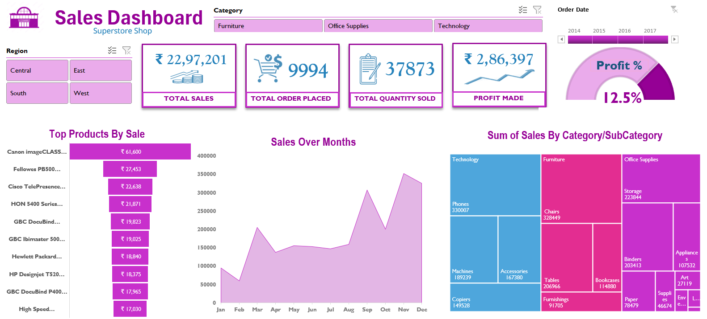

                                                                                  🛒 Sales Dashboard (Excel)

This project presents a Sales Performance Dashboard built entirely in Microsoft Excel, utilizing pivot tables, charts, and slicers to visualize and analyze sales data.

📊 Project Overview

The dashboard enables interactive sales insights across categories, subcategories, regions, and timeframes. It offers a comprehensive overview of key business metrics to help stakeholders identify sales trends and high-performing products.

✨ Features

-> KPIs covered:

📈 Total Sales
📦 Total Orders Placed
🔢 Total Quantity Sold
💰 Total Profit
📊 Profit Percentage

-> Interactive slicers:

Region-wise filter
Category-based filter
Time period filter using Order Date slider

-> Visual Components

Area Chart showing Monthly Sales Trend
Funnel Chart representing Top Products by Sales
Gauge Chart visualizing the Profit Percentage
Tree Map displaying Sales by Category/Subcategory

🔍 Insights Gained

📌 Highest Sales Year: 2017 contributed the most to total sales.
🏆 Top Product: Canon imageCLASS 2200 generated the highest revenue.
💹 Best Performing Category: Technology led in total sales, with Phones as the top subcategory.
🧾 Profitability: Overall profit margin stood at 12.5%.
🌍 Regional Insights: Region-wise slicing allows identification of performance variation across areas.

💼 Use Cases

Business sales performance tracking
Identifying high- and low-performing product segments
Strategic decision-making through data-driven insights
Excel dashboarding and reporting portfolio demonstration

## 📸 Dashboard Preview

